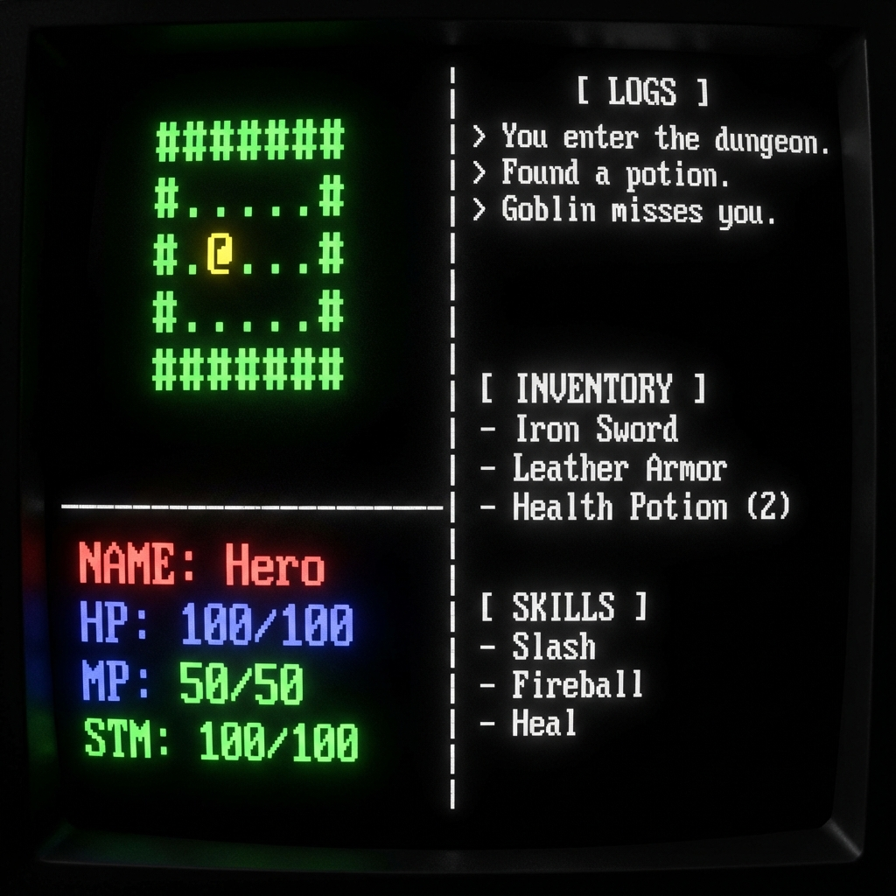

# Gemini 프로젝트: 던전 크롤러

이 프로젝트는 파이썬 기반의 클래식 터미널 로그라이크 게임입니다. 게임 로직은 `dungeon/` 디렉토리 내의 여러 모듈로 분리되어 있으며, **컴포넌트-엔티티-시스템(ECS) 패턴**을 기반으로 설계되어 확장성, 유지보수성, 재사용성을 극대화합니다.

## 🎯 최종 목표
터미널 기반의 로그라이크 게임 엔진을 ECS 패턴을 기반으로 완성하여, 규칙과 데이터를 실행 로직과 분리하여 관리합니다.



## 🎮 Roguelike Game Engine Architecture (ECS)

### 📂 핵심 디렉토리 및 모듈 역할

#### 1. Engine Core (엔진 핵심)
-   **`engine.py`**: 게임의 메인 루프 실행, `EntityManager` 초기화, 모든 `System`의 순서별 `update()` 호출 등 게임 흐름 제어.
-   **`entity.py`**: `Entity`의 고유 ID 생성 및 관리. `EntityManager` 클래스를 포함하여 컴포넌트 추가/검색 기능 제공.
-   **`component.py`**: `Entity`에 부여되는 모든 순수 데이터 클래스(State) 정의. (예: `PositionComponent`, `HealthComponent`).
-   **`system.py`**: 컴포넌트를 가진 `Entity`를 처리하는 순수 로직 정의. (예: `MovementSystem`, `CombatSystem`, `RenderingSystem`).

#### 2. Game Data & Definitions (데이터 정의)
-   **`data_manager.py`**: 외부 데이터 파일(`.txt`, `.json`)을 읽어 템플릿(Definition) 객체로 변환하는 로직.
-   **`data/` (디렉토리)**: 모든 게임 데이터 파일 저장소. (`items.txt`, `skills.txt`, `monster_data.txt` 등)
-   **`data/spawn_data.txt`**: 몬스터와 아이템의 스폰 위치, 확률, 드롭 아이템을 결정하는 메타 데이터.

#### 3. Features & Utilities (기능 및 유틸리티)
-   **`map.py`**: 던전 맵 생성 및 관리 로직. 충돌 감지, 시야 계산 등을 담당. (기존 `dungeon_map.py`에서 변경됨)
-   **`ui.py`**: 입력(Input) 처리 및 출력(Output), 터미널 렌더링을 담당하는 UI 인터페이스. (기존 `renderer.py`에서 변경됨)
-   **`data/UI_layout.json`**: UI 레이아웃과 관련된 설정(좌표, 크기 등)을 저장하는 데이터 파일.

## 개발 가이드라인

-   **코딩 스타일**: 파이썬 PEP 8 표준을 준수합니다.
-   **의존성**: `readchar` 라이브러리를 사용합니다.
-   **UI**: 모든 UI 구성 요소는 `dungeon/ui.py`에서 렌더링됩니다.
-   **게임 데이터**: 플레이어 및 맵 데이터는 `game_data/` 디렉토리에 JSON 파일로 저장됩니다.

## 게임 데이터 정의

### 스탯 (Stats)
-   **HP (체력)**: 캐릭터/몬스터의 생명력.
-   **MP (마력)**: 스킬 사용에 필요한 자원.
-   **ATT (공격력)**: 공격 시 상대에게 입히는 데미지에 영향을 줍니다.
-   **DEF (방어력)**: 상대의 공격으로부터 받는 데미지를 감소시킵니다.

### 레벨 (LV) 및 경험치 (EXP)
-   **LV (레벨)**: 캐릭터의 기본 스탯 성장률을 결정하고, 아이템/스킬 사용 요구 조건으로 작동합니다.
-   **EXP (경험치)**: 몬스터 처치 시 획득하며, 일정량 모으면 레벨업합니다.

### 몬스터 표시 및 상호작용
-   **맵 표시**: 몬스터는 `monster_data.txt`에 정의된 고유한 ASCII 심볼(예: 고블린은 'g')로 맵에 표시됩니다.
-   **접근 메시지**: 플레이어가 몬스터로부터 3칸 이내로 접근하면 메시지 로그에 "[몬스터 이름](LV)을(를) 만났습니다."와 같은 메시지가 표시됩니다.

## 최근 변경 사항 요약

### 2025년 10월 9일 목요일
-   **프로젝트 구조 재편성 (ECS 아키텍처 기반)**: 엔진 핵심 로직을 `dungeon/`으로, 모든 게임 데이터를 `data/`로 분리했습니다. `game.py` -> `dungeon/engine.py`, `dungeon_map.py` -> `dungeon/map_manager.py`, `ui.py` -> `dungeon/renderer.py` 등으로 파일 이름을 변경하고 이동했습니다.
-   **게임 플레이 규칙 변경**: 몬스터 리젠 로직 수정, 맵 크기 점진적 증가 로직 변경.
-   **유지보수**: 파일명 오타 수정 (`componant.py` -> `component.py`, `system.pu` -> `system.py`).

### 2025년 10월 12일 토요일
-   **ECS 아키텍처 관련 버그 수정**: `AttributeError: 'Monster' object has no attribute 'x'`, `AttributeError: 'Monster' object has no attribute 'max_hp'`, `KeyError: None`, `NameError: name 'Player' is not defined`, `AttributeError: 'Player' object has no attribute 'max_hp'`, `AttributeError: 'Player' object has no attribute 'color'`, `UnboundLocalError: cannot access local variable 'current_dungeon_level'`, `AttributeError: 'EntityManager' object has no attribute 'has_component'` 등 ECS 전환 과정에서 발생한 다양한 버그를 수정하고 안정화했습니다. 특히, 몬스터 및 플레이어의 스탯/위치 정보가 컴포넌트를 통해 올바르게 관리되도록 수정했습니다.

### 2025년 11월 24일 월요일
-   **UI 입력 가이드 개선**: `dungeon/ui.py` 파일에서 메인 메뉴의 플레이어 이름 입력 프롬프트에서 불필요한 `(Enter)` 가이드를 제거했습니다.
-   **실시간 입력 반영**: `dungeon/ui.py` 파일의 `render_all` 함수 내 게임 조작 가이드를 실시간 키 입력 방식에 맞춰 WASD, 방향키, HJKL, YUBN 등 다양한 이동 옵션과 인벤토리([I]) 단축키를 명시하도록 업데이트했습니다.
-   **엔진 입력 처리 확인**: `dungeon/engine.py`는 이미 `readchar` 라이브러리를 사용하여 실시간 키 입력을 처리하고 있으므로 별도 수정 사항이 없습니다.
-   **NameError 수정**: `dungeon/system.py` 파일에 `DungeonMap` 클래스를 임포트하여 `MovementSystem` 초기화 시 `NameError`가 발생하지 않도록 수정했습니다.
-   **NameError 수정**: `dungeon/system.py` 파일에 `Item` 클래스를 임포트하여 `InventorySystem` 클래스 내 `add_item` 메서드에서 `NameError`가 발생하지 않도록 수정했습니다.
-   **실시간 입력 처리 구현**: `dungeon/system.py` 파일의 `InputSystem`에서 `input()` 대신 `readchar.readchar()`를 사용하여 Enter 키 없이 바로 입력이 처리되도록 수정하고, `readchar` 모듈을 임포트했습니다.
-   **NameError 수정**: `dungeon/system.py` 파일에 `logging` 모듈을 임포트하여 `InputSystem`에서 `NameError`가 발생하지 않도록 수정했습니다.

### 2025년 12월 20일 토요일 (GEMINI.md 기준 리팩토링)
-   **프로젝트 구조 재정비**: `Start.py`와 `dungeon/engine.py`의 연결을 복구하여 게임 실행이 가능하도록 수정했습니다.
-   **렌더링 시스템 교체**: `dungeon/renderer.py`를 신규 생성하고 **더블 버퍼링(Double Buffering)** 기술을 적용하여 UI 깜빡임 현상을 제거했습니다. 기존 `ConsoleUI` 클래스는 제거되었습니다.
-   **ECS 데이터 표준화**: `HealthComponent`, `AttackComponent` 등 파편화된 컴포넌트를 `StatsComponent`로 통합하여 데이터 관리를 표준화했습니다. (`GEMINI.md` 준수)
-   **UI 개선**: 게임 화면을 좌측(맵/스탯)과 우측(로그/인벤토리)으로 분할하는 스플릿 스크린 레이아웃을 적용했습니다. (해상도 120x30으로 확장)
-   **인벤토리 시스템**: `i` 키를 눌러 호출할 수 있는 팝업형 인벤토리 시스템을 구현했습니다.
-   **Game Design**: `GEMINI.md`에 상세 게임 기획(속성, 직업, 파밍 등)을 통합했습니다.

## 일반적인 명령어

-   **게임 실행**:
    ```bash
    python3 main.py
    ```
-   **저장 데이터 삭제**:
    ```bash
    rm -rf /home/dogsinatas/python_project/dungeon/game_data/*
    ```