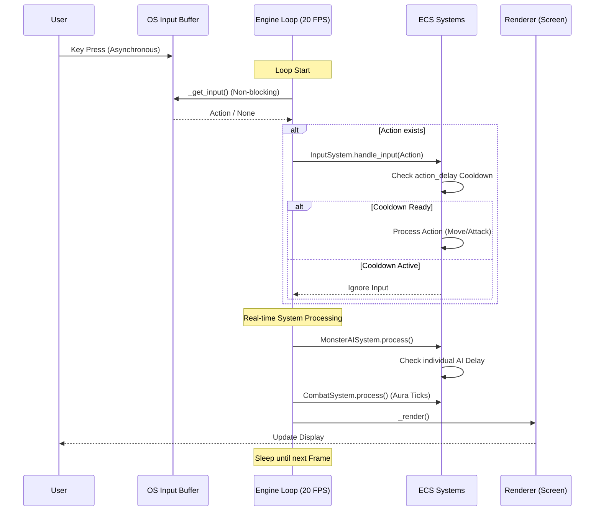

# Dungeon Crawler 프로젝트 개발 백서 (White Paper)

## 1. 프로젝트 개요
**Dungeon Crawler**는 고전 명작 '디아블로 1'의 영감을 받아 터미널 환경에서 실시간으로 즐길 수 있도록 설계된 로그라이크 액션 RPG 게임입니다. 이 프로젝트는 인간 개발자와 Gemini AI 에이전트 간의 긴밀한 페어 프로그래밍을 통해 현대적인 소프트웨어 아키텍처와 고전적인 게임 감성을 결합하는 것을 목표로 시작되었습니다.

- **개발 기간**: 2025년 12월 ~ 2026년 1월
- **주요 기술 스택**: Python 3, Entity Component System (ECS), ANSI Terminal UI, ALSA/FFmpeg Audio
- **버전**: v1.0 정식 출시 (2026-01-11)

## 2. 주요 기술적 성과

### 2.1 ECS (Entity Component System) 아키텍처
게임의 복잡한 상태 변화를 관리하기 위해 데이터(Component)와 로직(System)을 완전히 분리한 ECS 구조를 도입했습니다. 이를 통해 새로운 몬스터 패턴, 아이템 옵션, 마법 효과를 기존 코드의 수정 없이 유연하게 추가할 수 있는 확장성을 확보했습니다.

### 2.2 ANSI 터미널 더블 버퍼링 UI
터미널 환경 특유의 화면 깜빡임을 해결하기 위해 커스텀 더블 버퍼링 렌더링 엔진을 구현했습니다. ANSI 이스케이프 코드를 최적화하여 초당 30프레임 이상의 부드러운 실시간 화면 갱신을 달성했습니다.

### 2.3 밸런스 시뮬레이션 시스템
개발 후반기, 수천 번의 자동 플레이 시뮬레이션을 수행하여 모든 직업군의 클리어 가능성을 검증했습니다. 이를 통해 아이템 드롭률, 몬스터 스펙, 강화 성공률을 수학적으로 정교화하여 v1.0의 안정적인 밸런스를 구축했습니다.

### 2.4 실시간 구현 핵심 기술
터미널 RPG의 한계를 넘어선 역동성을 위해 다음과 같은 실시간 엔진 기술을 개발 및 적용했습니다:
- **비차단(Non-blocking) 입력 시스템**: `termios` 및 `tty` 라이브러리를 직접 제어하여 운영체제 수준의 버퍼링을 제거하고, 사용자의 키 입력을 즉각적으로 캡처하는 고성능 입력 대기열을 구현했습니다.
- **액션 딜레이 기반 동기화**: `stats.action_delay`와 `last_action_time` 매커니즘을 통해 상호 턴을 기다리지 않는 실시간 쿨다운 시스템을 완성했습니다. 이를 통해 플레이어와 몬스터가 각자의 속도로 독립적으로 행동합니다.
- **20 FPS 고정 루프 ECS**: 매 프레임 모든 ECS 시스템을 갱신하는 고정 시간 간격 루프를 도입하여, 지속 시간 기반 스킬(휠윈드, 오라 등)과 환경 함정의 실시간 상호작용을 정밀하게 제어했습니다.

#### 실시간 엔진 흐름도 (Real-time Engine Sequence Diagram)

## 3. 개발 연혁 및 마일스톤

### 2025년 3월 ~ 11월: 초기 구상 및 프로토타이핑 (Gemini Web & CLI)
- **Gemini Web**: 프로젝트의 기초 아이디어 구상 및 초기 게임 로직의 초안 작성.
- **Gemini CLI**: 터미널 기반 개발 환경으로 전환하여 엔진의 코어를 구축하고, 객체 지향 구조에서 보다 효율적인 **ECS(Entity Component System)** 아키텍처로의 대대적인 구조 개편 단행.

### 2025년 12월: 본격적인 개발 돌입 (Antigravity 도입)
- **Antigravity 환경 전환**: 고도화된 에이전트 환경인 Antigravity를 통해 복잡한 시스템 간의 통합 및 대규모 리팩토링 수행.
- 프로젝트 코어 엔진 고도화 및 ECS 시스템 안정화.
- 기본 이동, 전투 및 실시간 맵 생성 알고리즘의 완성.
- 다국어 지원(한국어/영어) 및 로컬라이제이션 시스템 구축.

### 2026년 1월 초: 시스템 확장기
- **디아블로 1 스타일 마법 시스템**: 18종의 마법(Apocalypse, Mana Shield 등) 완전 구현
- **고급 신전 및 강화 시스템**: 오일, 제물을 활용한 장비 강화 로직 완성
- **사운드 시스템**: 실시간 효과음 및 배경음악 연동

### 2026년 1월 중순: 완성 및 최적화 (v1.0)
- **보스전 시스템**: 99층 최종 보스 디아블로 및 유니크 보스 패턴 구현
- **랭킹 시스템**: 명예의 전당/불명예의 전당 및 상세 캐릭터 정보 확인 기능 추가
- **최종 밸런싱**: 시뮬레이터 기반 데이터 튜닝 및 버그 제로 달성

## 4. AI와 인간의 협업 방식
이 프로젝트의 가장 큰 특징은 **Gemini AI**를 단순한 코드 생성기가 아닌, 아키텍처를 고민하고 밸런스를 튜닝하는 '에이전트'로서 활용했다는 점입니다. 인간 개발자는 비전과 기획을 제시하고, AI는 이를 구체적인 시스템으로 설계하며 코드의 안정성을 검증하는 선순환 구조로 개발되었습니다.

## 5. 앞으로의 비전
Dungeon Crawler v1.0은 하나의 완성된 결과물이자, 더 큰 가능성을 향한 시작점입니다. 향후 모드(MOD) 시스템 지원, 추가 클래스 확장, 그리고 더 정교한 절차적 맵 생성 알고리즘 도입을 통해 터미널 로그라이크의 한계에 계속 도전할 것입니다.

---
**2026년 1월 11일**
**Dungeon Crawler 개발팀 (Human & Gemini AI)**
