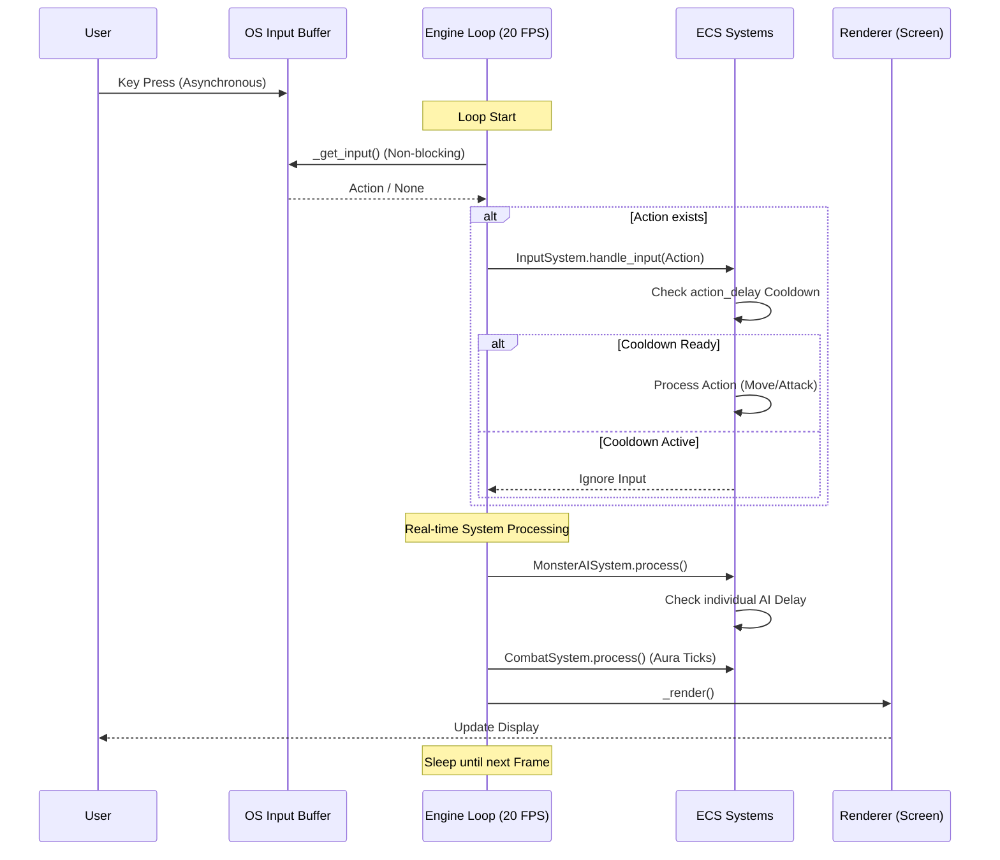

# Dungeon Crawler Project Development White Paper

## 1. Project Overview
**Dungeon Crawler** is a real-time terminal-based roguelike Action RPG inspired by the classic 'Diablo 1'. This project began with the goal of combining modern software architecture with classic gaming sensibilities through close pair programming between a human developer and the Gemini AI agent.

- **Development Period**: December 2025 – January 2026
- **Primary Tech Stack**: Python 3, Entity Component System (ECS), ANSI Terminal UI, ALSA/FFmpeg Audio
- **Version**: v1.0 Official Release (2026-01-11)

## 2. Key Technical Achievements

### 2.1 ECS (Entity Component System) Architecture
To manage complex game state changes, we introduced an ECS structure that completely separates data (Components) and logic (Systems). This ensures flexibility and scalability to add new monster patterns, item options, and magic effects without modifying existing core logic.

### 2.2 ANSI Terminal Double Buffering UI
To resolve the flickering issues inherent in terminal environments, we implemented a custom double-buffering rendering engine. By optimizing ANSI escape codes, we achieved smooth real-time screen updates at over 30 FPS.

### 2.3 Balance Simulation System
Late in development, we performed thousands of automated simulations to verify the clearability of all character classes. This allowed us to mathematically refine item drop rates, monster stats, and enhancement success rates for a stable v1.0 balance.

### 2.4 Core Real-time Technologies
To achieve dynamic gameplay beyond terminal RPG limits, we developed the following real-time engine technologies:
- **Non-blocking Input System**: Direct control of `termios` and `tty` libraries to bypass OS-level buffering and implement a high-performance input queue that captures keystrokes instantly.
- **Delay-based Synchronization**: A real-time cooldown system using `stats.action_delay` and `last_action_time` mechanisms, allowing players and monsters to act independently at their own speeds without waiting for turns.
- **20 FPS Fixed-Loop ECS**: A fixed-time interval loop that updates all ECS systems every frame, enabling precise real-time control of duration-based skills (Whirlwind, Auras, etc.) and environmental traps.

#### Real-time Engine Sequence Diagram

## 3. Development History & Milestones

### March – November 2025: Early Concept & Prototyping (Gemini Web & CLI)
- **Gemini Web**: Conceptualized the foundation and drafted initial game logic.
- **Gemini CLI**: Transitioned to a terminal-based dev environment, built the core engine, and underwent a major architectural shift from OOP to a more efficient **ECS** model.

### December 2025: Full-scale Development (Antigravity Era)
- **Transitioned to Antigravity**: Performed large-scale refactoring and integration of complex systems via the advanced Antigravity agent environment.
- Stabilized the ECS core and advanced engine features.
- Completed core movement, combat, and real-time map generation algorithms.
- Built a localization system with full Korean/English support.

### Early January 2026: System Expansion
- **Diablo 1-style Magic System**: Implemented all 18 spells (Apocalypse, Mana Shield, etc.).
- **Advanced Shrine & Enhancement System**: Completed equipment enhancement logic using Oils and Sacrifices.
- **Sound System**: Integrated real-time sound effects and background music.

### Mid-January 2026: Finalization & Optimization (v1.0)
- **Boss System**: Implemented unique boss patterns and the final encounter with Diablo on Floor 99.
- **Ranking System**: Added Hall of Fame/Dishonor and detailed hero history features.
- **Final Balancing**: Refined data through simulation-based tuning and achieved zero-bug stability.

## 4. AI-Human Collaboration
The defining characteristic of this project is the use of **Gemini AI** not just as a code generator, but as an 'Agent' that designs architectures and tunes balance. The development was a virtuous cycle where the human developer provided vision and planning, while the AI designed concrete systems and verified technical stability.

## 5. Future Vision
Dungeon Crawler v1.0 is both a finished product and a starting point for greater possibilities. We will continue to push the boundaries of terminal roguelikes by introducing MOD support, additional class expansions, and even more sophisticated procedural generation algorithms.

---
**January 11, 2026**
**Dungeon Crawler Development Team (Human & Gemini AI)**
